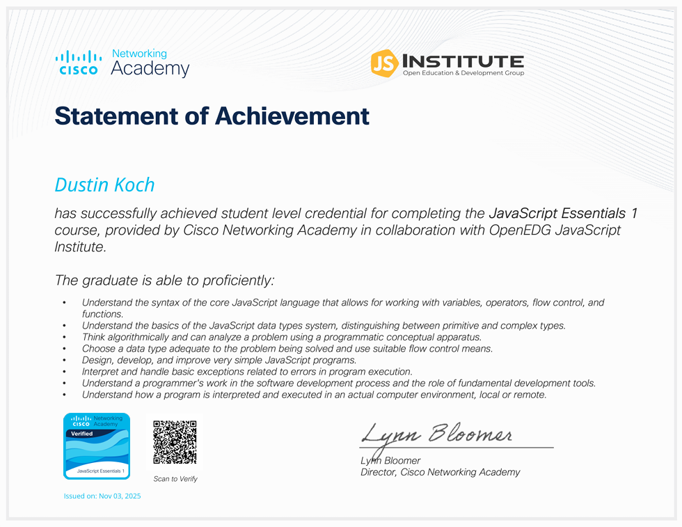
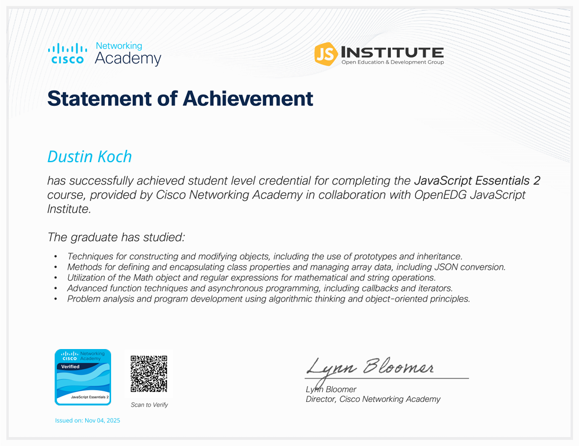
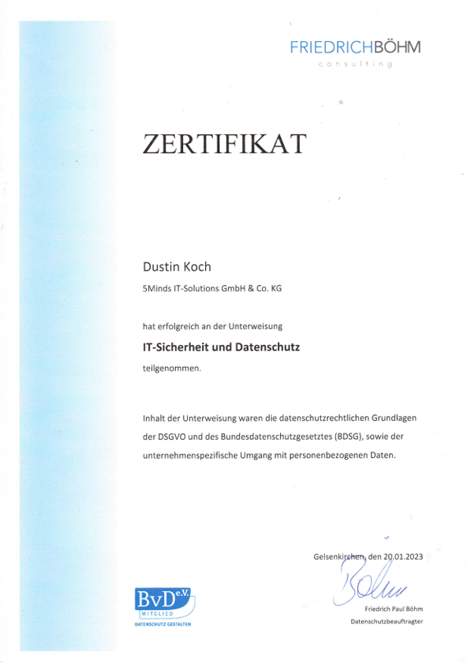

# Dustin Koch

	📍 <b>Gelsenkirchen</b>

 

	<b>Full-Stack Developer</b>

---

## 🚀 Über mich

	Ich bin Anwendungsentwickler mit Fokus auf Full-Stack- und
    Mobile-Lösungen. Ich entwickle robuste, wartbare Anwendungen mit
    Typescript, React und modernen Tools.
    Ich bringe komplexe Probleme auf den Punkt und entwickle daraus klare, nutzerfreundliche Lösungen.

---

## 🛠️ Skills

<table>
	<tr>
		<td align="center" width="96"><b>⭐</b>  <b>TypeScript</b></td>
		<td align="center" width="96"><b>⭐</b>  <b>JavaScript</b></td>
		<td align="center" width="96"><b>⭐</b>  <b>React</b></td>
		<td align="center" width="96"><b>⭐</b>  <b>Next.js</b></td>
		<td align="center" width="96"><b>⭐</b>  <b>Node.js</b></td>
		<td align="center" width="96"><b>⭐</b> 🗂️ <b>BPMN</b></td>
		<td align="center" width="96"><b>⭐</b>  <b>Tailwind</b></td>
	</tr>
	<tr>
			<td align="center" width="96">
				
				 HTML
			</td>
			<td align="center" width="96">
				
				 CSS
			</td>
			<td align="center" width="96">
				
				 ShadCn
			</td>
			<td align="center" width="96">
				
				 SQL
			</td>
			<td align="center" width="96">
				
				 MariaDB
			</td>
			<td align="center" width="96">
				
				 REST
			</td>
			<td align="center" width="96">
				
				 SQLite
			</td>
	</tr>
	<tr>
		<td align="center" width="96">
			
			 VBS
		</td>
		<td align="center" width="96">
			
			 CSharp
		</td>
		<td align="center" width="96">
			
			 Python
		</td>
		<td align="center" width="96">
			
			 Docker
		</td>
		<td align="center" width="96">
			
			 Figma
		</td>
		<td align="center" width="96">
			
			 Expo
		</td>
		<td align="center" width="96">
			
			 Electron
		</td>
	</tr>
</table>

---

## 🏢 Berufserfahrung

	

		<h2 style="margin: 0; font-size: 2em;">5Minds GmbH & Co.KG</h2>
		<h3 style="margin: 0; font-size: 1.3em; font-weight: normal; color: #555;">Junior Anwendungsentwickler : Fullstack</h3>
		<h3 style="margin: 0; font-size: 1.3em; font-weight: normal; color: #555;">Gelsenkirchen</h3>
		2022 – 2025
	

## 🏆 Zertifizierungen

<table>
  <tr>
    <td align="center" width="180">
       
      <b>JavaScript Essentials 1</b> 
      Cisco Network Academy 2025
    </td>
    <td align="center" width="180">
       
      <b>JavaScript Essentials 2</b> 
      Cisco Network Academy 2025
    </td>
	<td align="center" width="160">
       
      <b>IT-Sicherheit und Datenschutz</b> 
      FriedrichBoehm consulting  2023
    </td>
  </tr>
</table>

## ℹ Bonus Informationen

	
<b>Mein Start in die Programmierung</b>

	 
	Meine Liebe zur Programmierung fing früh an. Mit 12 Jahren habe ich durch Minecraft meine ersten Erfahrungen gesammelt und mit Java Spielerweiterungen/Plugins geschrieben.
	 
	 
	Während meiner Zeit als Minecraft-Entwickler durfte ich mit Servernetzwerken wachsen. In dieser Zeit wurde ich von einem anderen Entwickler darauf aufmerksam gemacht, dass man auch Web-Entwicklung in Minecraft-Plugins einbauen kann. 
	 
	 
	In diesem Moment habe ich meine Programmierer-"Liebe" gefunden: die Web-Entwicklung. Schritt für Schritt den Fortschritt visuell verfolgen zu können, erfüllt mich. Zu sehen, wie ein Projekt mit einem wächst – das ist Programmierung für mich.

